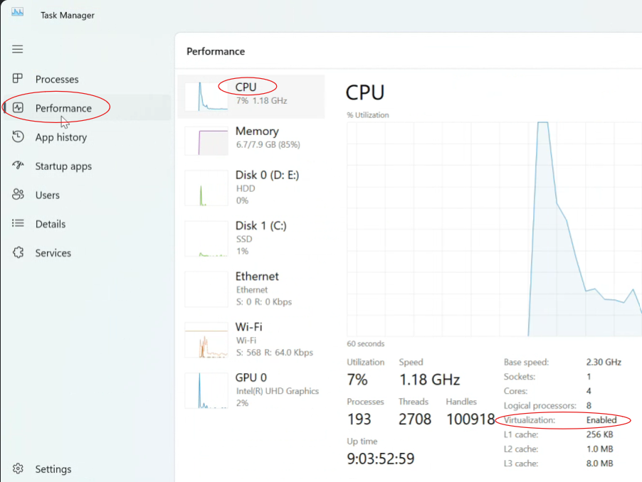
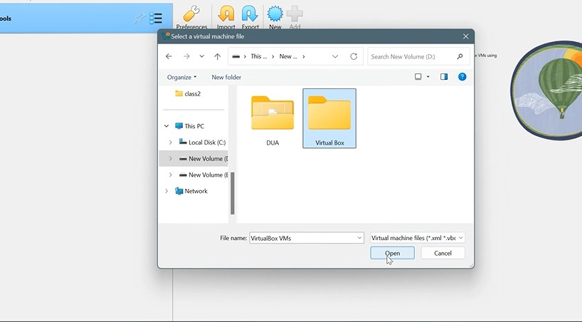
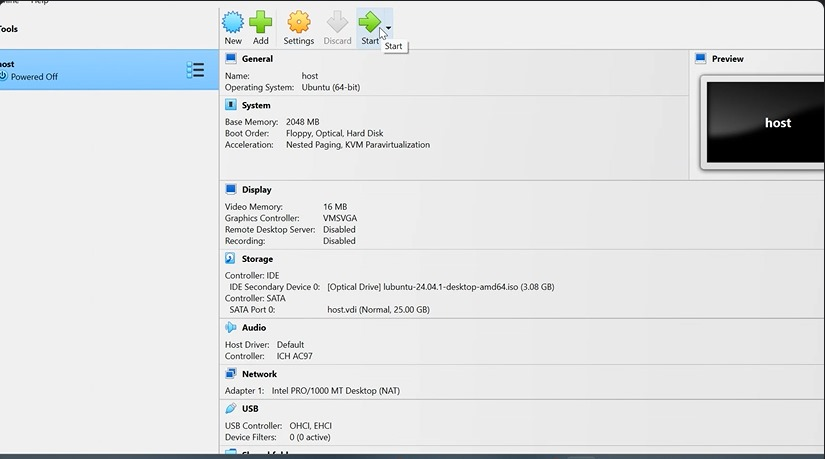
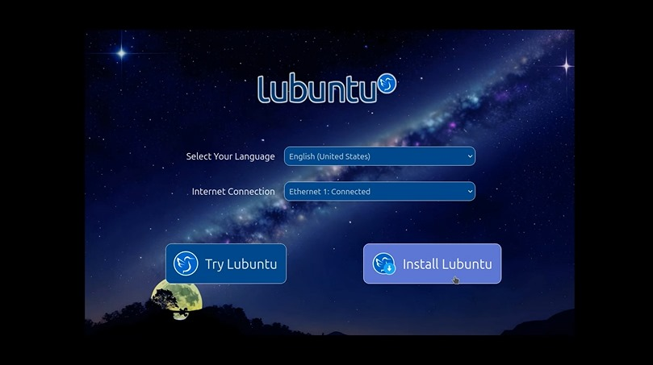

# Install Virtual Box:
To check if virtualization is enabled and enable it if necessary, follow these steps:

#### 1. Open Task Manager:

Press Ctrl + Shift + Esc or Right-click the taskbar and select Task Manager.
Navigate to the Performance Tab:

In the Task Manager window, click the Performance tab located on the left-hand side.
#### 2. Check Virtualization Status:

Look at the bottom right of the window under the CPU section.
If you see Virtualization: Disabled, it means virtualization is currently turned off.

# Get started with VirtualBox and Lubuntu:

#### 1.Download and Install VirtualBox:
Visit the [VirtualBox Downloads page](https://www.virtualbox.org/wiki/Downloads).
On the page, select the appropriate version for your operating system (Windows, macOS, Linux, etc.).
Once the download is complete, open the installer and follow the on-screen instructions to install VirtualBox on your computer.
#### 2.Download the Latest Version of Lubuntu:
After installing VirtualBox, go to the [Lubuntu Download page](https://lubuntu.me/downloads/).
Click on the latest version of Lubuntu to start downloading the ISO file.
Don't Install Lubuntu now.
#### 3.Create a folder:
Create a new folder on a drive other than C to be safe. Name the folder exactly as "Virtual Box" (be sure to match the capitalization and spelling).

#### 4.Create Virtual Machine(Host):
Launch the VirtualBox application on your system.

Click on "New". 
In the dialog box that appears, enter the name as host.(Be careful with the naming—do not change it later.)
VirtualBox may auto-fill some settings like the operating system and version based on the name. If not, set them manually:
Type: Linux
Version: Ubuntu (32-bit or 64-bit, depending on your ISO)
Select the Folder:

In the "Machine Folder" field, browse to the folder you just created to store the virtual machine files.
Choose the ISO File:

When prompted to select a startup disk or ISO file:
Browse to the location where you downloaded the lubuntu.iso file.
Select the file.
After reviewing the configuration, click "Finish" to create the virtual machine.

Open VirtualBox:

Locate and click the "New" button in the VirtualBox Manager interface.
Name Your Virtual Machine:

