# Install Virtual Box:
To check if virtualization is enabled and enable it if necessary, follow these steps:

#### 1. Open Task Manager:

Press Ctrl + Shift + Esc or Right-click the taskbar and select Task Manager.
Navigate to the Performance Tab:

In the Task Manager window, click the Performance tab located on the left-hand side.
#### 2. Check Virtualization Status:

Look at the bottom right of the window under the CPU section.
If you see Virtualization: Disabled, it means virtualization is currently turned off.

# Get started with VirtualBox and Lubuntu:

#### 1. Download and Install VirtualBox:
Visit the [VirtualBox Downloads page](https://www.virtualbox.org/wiki/Downloads).
On the page, select the appropriate version for your operating system (Windows, macOS, Linux, etc.).
Once the download is complete, open the installer and follow the on-screen instructions to install VirtualBox on your computer.
#### 2. Download the Latest Version of Lubuntu:
After installing VirtualBox, go to the [Lubuntu Download page](https://lubuntu.me/downloads/).
Click on the latest version of Lubuntu to start downloading the ISO file.
Don't Install Lubuntu now.
#### 3. Create a folder:
Create a new folder on a drive other than C to be safe. Name the folder exactly as "Virtual Box" (be sure to match the capitalization and spelling).

#### 4. Create Virtual Machine(Host):
Launch the VirtualBox application on your system.Click on "New".

In the dialog box that appears, enter the name as "host".(Be careful with the naming—do not change it later.)

VirtualBox may auto-fill some settings like the operating system and version based on the name. If not, set them manually:

###### Type: Linux
###### Subtype: Ubuntu
###### Version: Ubuntu (32-bit or 64-bit, depending on your ISO)

In the "Folder" field, browse to the folder you just created to store the virtual machine files and select it.
In the "ISO Image" field, browse to the location where you downloaded the lubuntu.iso file and select the file.

Allocate Resources (Optional):

VirtualBox might ask you to configure resources like suggest a recommended memory size for Lubuntu. You can either accept the default value or adjust it based on your system's capacity. For disk space, follow the guided steps to create a virtual hard disk and choose the default settings unless you have specific requirements.

After reviewing the configuration, click "Finish" to create the virtual machine.

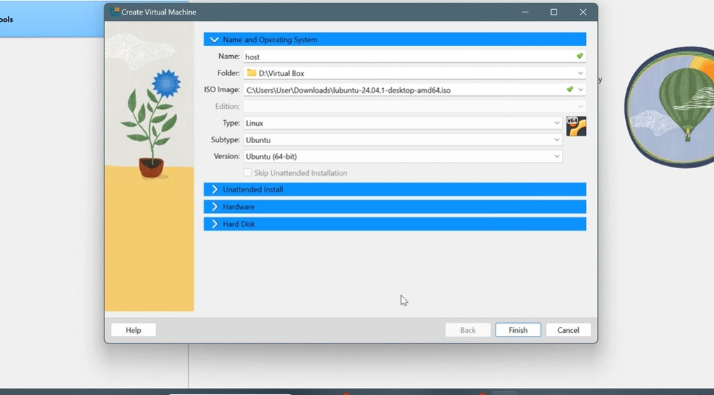

#### 5. Install Lubuntu
In VirtualBox, select the host virtual machine you just created and click Start.

When the boot menu appears, use the arrow keys to select "Try or Install Lubuntu" and press Enter.
In the window that appears, choose "Install Lubuntu" to begin the installation process.

After the installation begins, you'll see a Welcome page. Select your preferred language, Location, and Keyboard Layout.

Choose Normal Installation for a full Lubuntu installation.
When prompted for partitioning options, select Erase disk and install Lubuntu. Confirm if you’re asked to erase the disk.

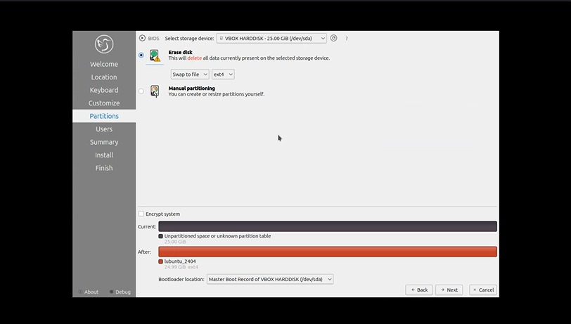

In the user configuration section, enter a short user name (e.g., user), set the password as 1234, confirm the password, and click Continue.

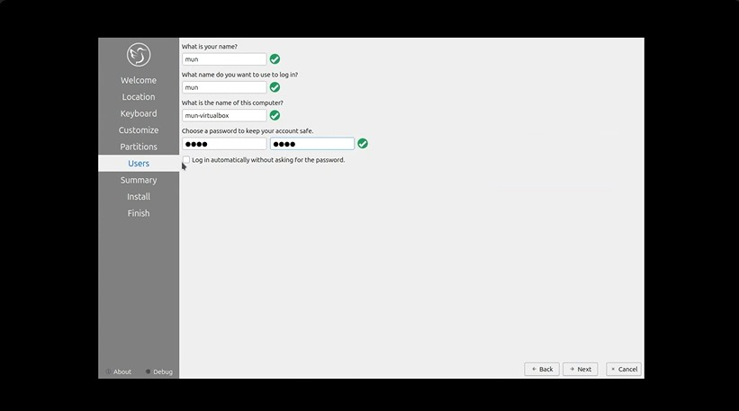

Click Install to begin the installation process. Once the installation is done, click Finish.
Restart the virtual machine if prompted.

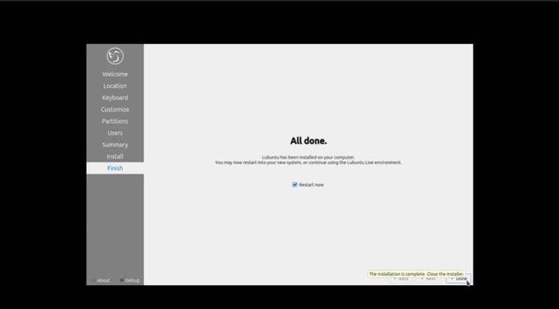

# Setting Up a Router and Internal Network:

#### 1.Create a Linked Clone: Clone your "host" VM again and name this clone "router."

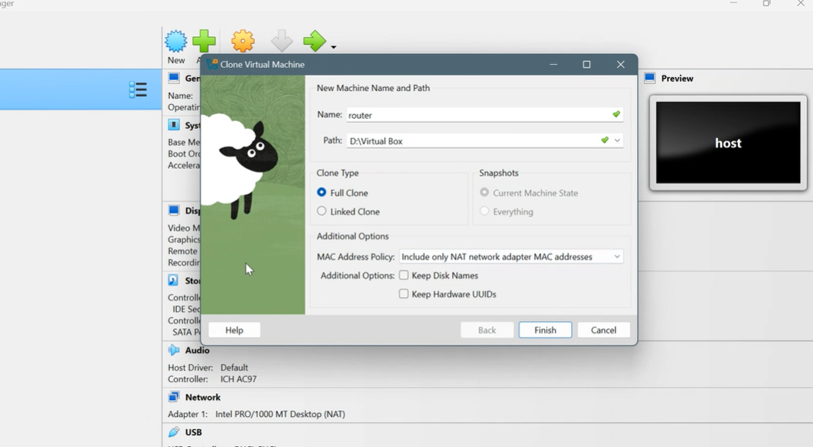

#### 2.Configure the Router in VirtualBox:
Go to the settings for the "Router" VM.
Set up network adapters as follows:

Adapter 1: Attach to NAT (for internet access).

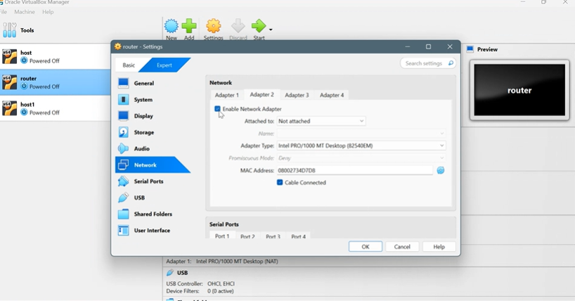

Adapter 2: Enable and attach to "Internal Network."

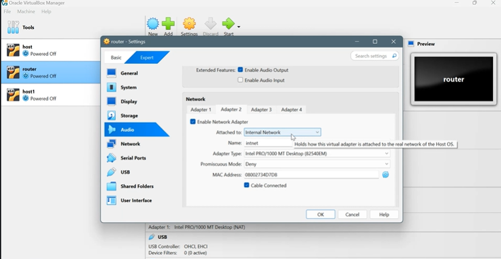

#### 3.Configure Network Settings in the Router VM:
Boot up the "Router" VM and open Network settings.
Configure the Ethernet settings:

Adapter 1 (NAT): Set IPv4 to Automatic (DHCP).

Adapter 2 (Internal Network):
Set IPv4 to Manual.
Assign IPv4 address: 192.168.0.1.
Set Netmask to 255.255.255.0.

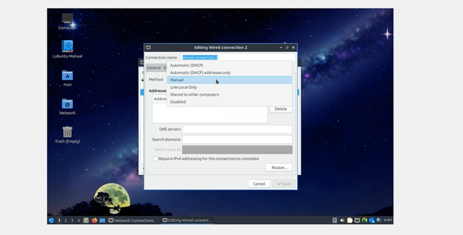

Start a terminal:

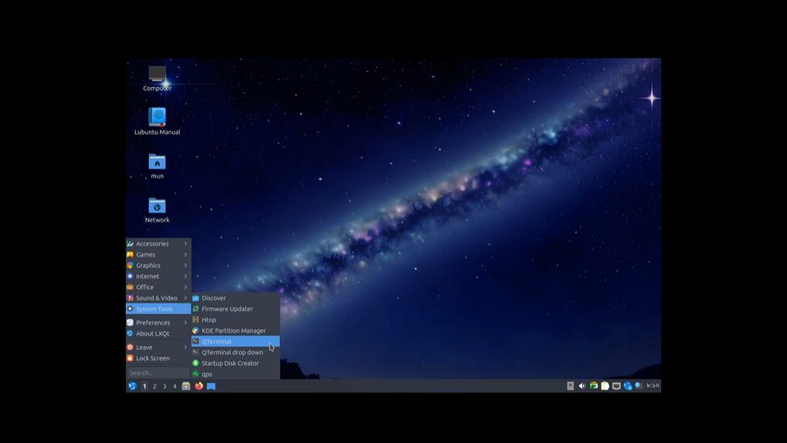

 

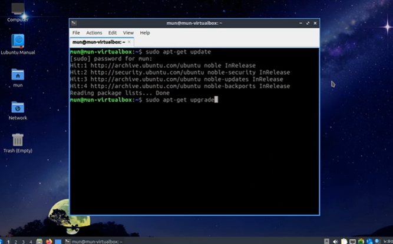

 

Edit sysctl.conf: Open /etc/sysctl.conf and uncomment the line:

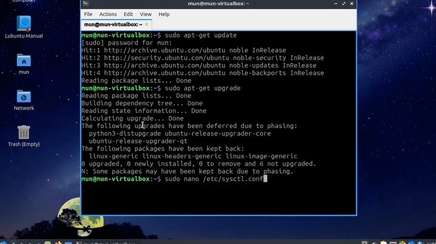

 

net.ipv4.ip_forward=1

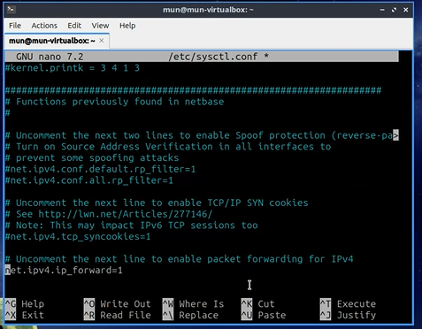

 

Reload sysctl.conf: Run: sudo sysctl -p
This reloads the changes to the system configuration.

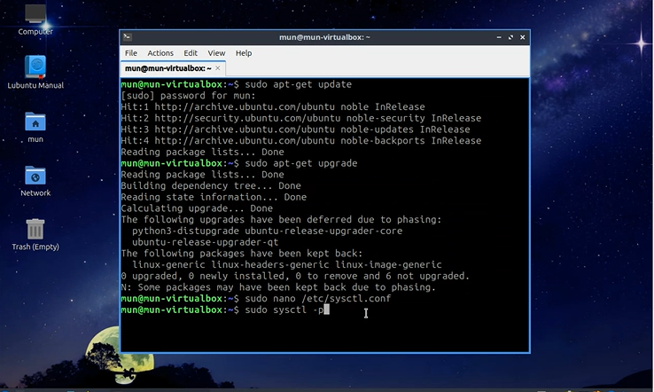

 

Note the Adapter 1 Interface: Run: ip addr

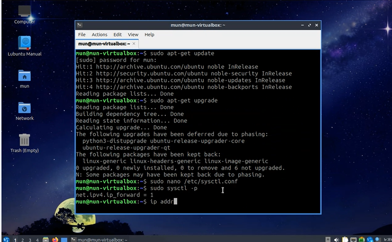

 

Configure NAT with iptables: Run the following command to enable NAT (Network Address Translation) and allow outbound connections:
sudo iptables -t nat -A POSTROUTING -o <interface> -j MASQUERADE

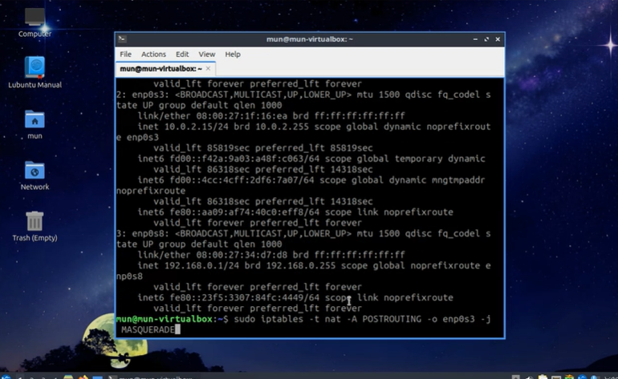

 

Replace <interface> with the name of your Adapter 1 interface (e.g., enp0s3).
Install iptables-persistent: 
Run:
sudo apt install iptables-persistent
This ensures that iptables rules persist after reboot.

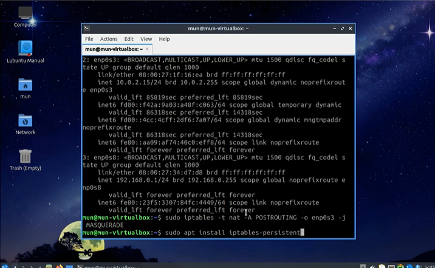

 

Run the following commands and capture their output:
ip addr - To check network interfaces and their configurations.
sudo iptables -t nat -L - To show the iptables NAT rule that was added.

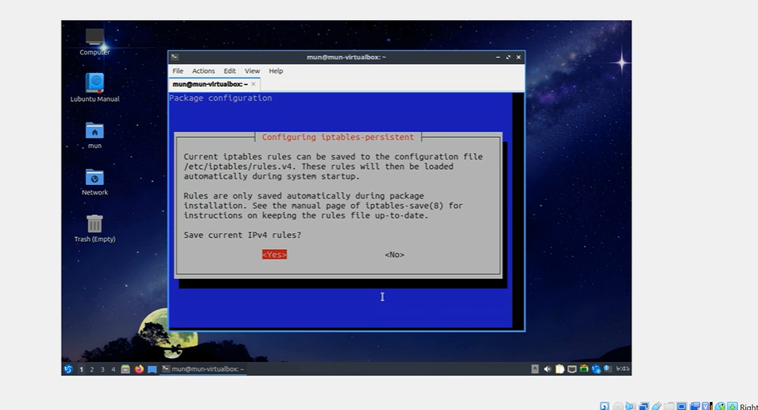

 

